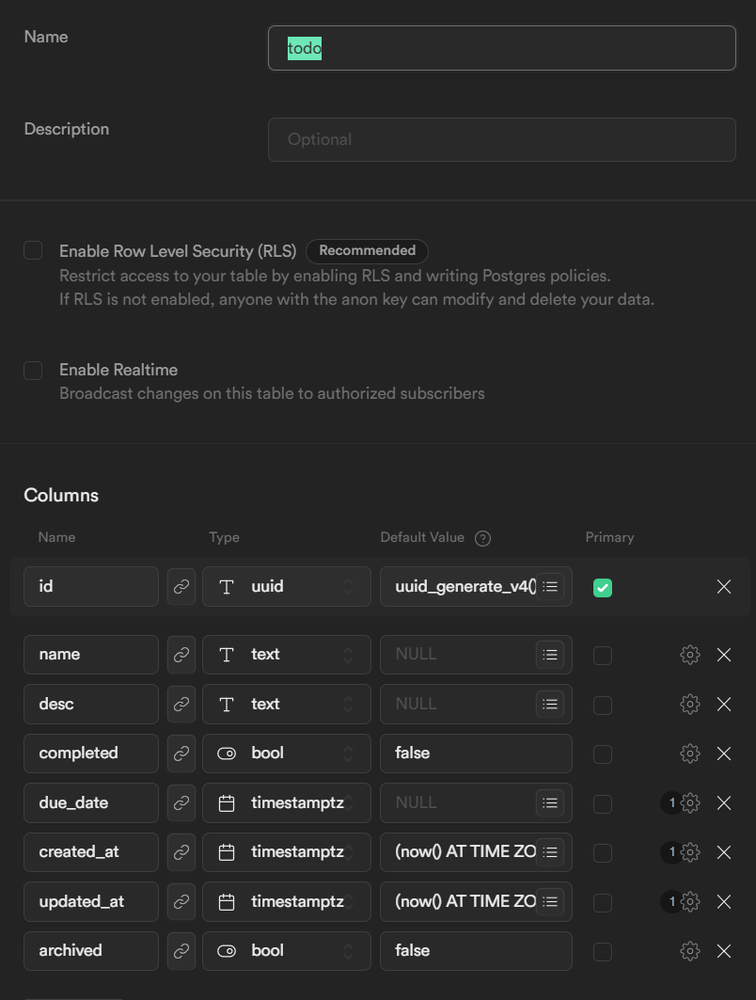

# Next-todo

An application that quickly showcases the basic features of Next.js along with Cypress testing, deployed to Vercel.

## Tech used

-   Next.js
-   Daisy UI
-   Cypress
-   React Query
-   Axios
-   Supabase-js

# Get started

## Create the table structure in Supabase



### Important!

-   **Make sure that RLS is disabled!**
-   **Make sure that the table name is 'todo'**

## Fill in environment variables in .env.example file

1.  Fill in the missing values in the .env.example file
2.  Rename the file to .env

## Getting Started

First, run the development server:

```bash
npm run dev
# or
yarn dev
```

Open [http://localhost:3000](http://localhost:3000) with your browser to see the result.

## Learn More

To learn more about Next.js, take a look at the following resources:

-   [Next.js Documentation](https://nextjs.org/docs) - learn about Next.js features and API.
-   [Learn Next.js](https://nextjs.org/learn) - an interactive Next.js tutorial.

You can check out [the Next.js GitHub repository](https://github.com/vercel/next.js/) - your feedback and contributions are welcome!

## Deploy on Vercel

The easiest way to deploy your Next.js app is to use the [Vercel Platform](https://vercel.com/new?utm_medium=default-template&filter=next.js&utm_source=create-next-app&utm_campaign=create-next-app-readme) from the creators of Next.js.

Check out our [Next.js deployment documentation](https://nextjs.org/docs/deployment) for more details.
